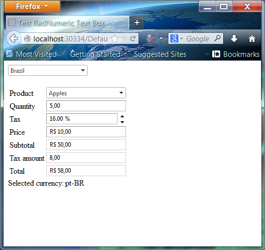
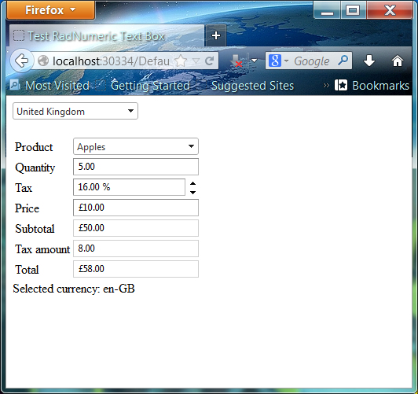
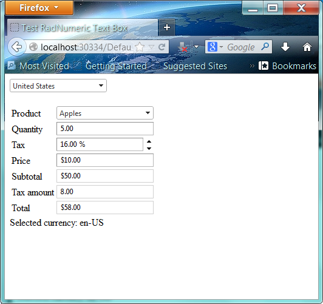
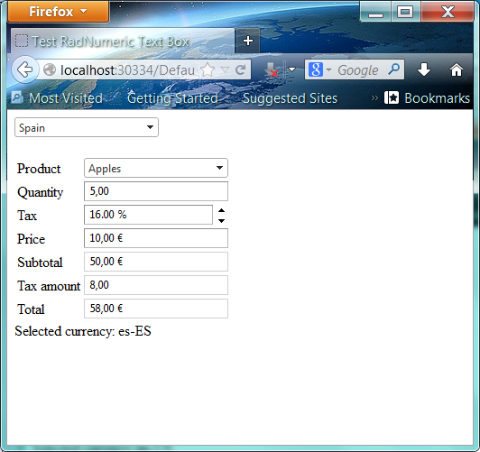

# Usando el control RadNumericTextBox de Telerik con ASP.NET

El <a href="http://www.telerik.com/help/aspnet-ajax/input-numerictextbox-basics.html">RadNumericTextBox</a> es uno de los controles que pertenecen al conjunto
de controles RadInput de telerik, estos controles además de permitir al usuario ingresar y editar información textual como si fuera un control TextBox ASP .NET tradicional, poseen propiedades adicionales como: eventos del lado del cliente, marca de agua, botón para aceptar, botones para selección de rango, mensaje predeterminado, tooltip, entre otras que extienden la funcionalidad básica proporcionada por el control TextBox ASP.NET estándar.

La funcionalidad principal del <a href="http://www.telerik.com/help/aspnet-ajax/input-numerictextbox-basics.html">RadNumericTextBox</a> es filtrar la entrada de datos permitiendo únicamente datos numéricos sin necesidad de programación Javascript o el uso de validators ASP .NET, este control además  puede configurarse para utilizar determinados formatos o configuraciones regionales.
Entre las propiedades de configuración se encuentran:
<ul>
<li>
<b>Type</b> Indica el formato del texto, <i>Number</i> para formato númerico, <i>Currency</i> para formato moneda, <i>Percent</i> para un formato porcentaje.
</li>
<li>
<b>Culture</b> Establece el soporte para la globalización y localización del valor.
</li>
<li>
<b>MinValue y MaxValue</b> Indican los valores minimos y maximos de un rango de valores.
</li>
<li>
<b>ShowSpinButtons</b> Estable la propiedad para mostrar un control de selección de flechas para el incremento o decremento del valor.
</li>
</ul>

Como ejemplo del uso de este control escribí una página ASP.NET que calcula los montos de un producto deacuerdo a su cantidad y su precio, mostrando caracteristicas utiles del RadNumericTextBox como la globalización y algunas funciones del lado del cliente. (client-side)

En la página ASP.NET, en el bloque JavaScript, dentro de la función <i>Calculate()</i> obtengo la referencia a los controles mediante la función <i>$find(“[nombre del control]”)</i> después utilizo las funciones <i>get_value()</i> y <i>set_value()</i> para obtener o establecer el valor. Estas funciones son del lado del cliente, porque del lado del server se hace con la propiedad <i>Text</i>.

En el control <i>txtQuantity</i> utilizo la propiedad <i>type=”Number”</i> lo que le da el formato numérico al valor

El control <i>txtTax</i> demuestra el uso de la propiedad <i>type=”percent”</i>, las propiedades para el valor mínimo (MinValue), valor máximo (MaxValue) y la propiedad <i>ShowSpinButtons.</i>

Los controles <i>txtSubtotal</i>, <i>txtTotal</i> y <i>txtPrice</i> muestran el uso de la propiedad <i>type=Currency</i> para dar formato de tipo moneda al valor, además en el control <i>txtPrice</i> utilizo el evento <i>ClientEvents-OnBlur</i> del lado del cliente  para invocar al método <i>Calculate</i> definido en el bloque JavaScript.

Por último en el code-behind utilizo la propiedad <i>Culture</i> para establecer el formato en los controles <i>RadNumericTextBox</i> según las preferencias de la cultura seleccionada.

Al ejecutar la página ASP.NET observaras los siguientes resultados,si el país es&nbsp; Brazil, las cantidades se formatean deacuerdo a la configuración de ese país.

Si el páis seleccionado es United Kingdom, lo mismo sucede con las cantidades y con las monedas en este caso aparece el símbolo de la libra (pound).

Si el país es United States,&nbsp; en las cantidades aparece el símbolo del Dollar.

 

Y por último si la opción del país es Spain, aparece el símbolo del Euro.

